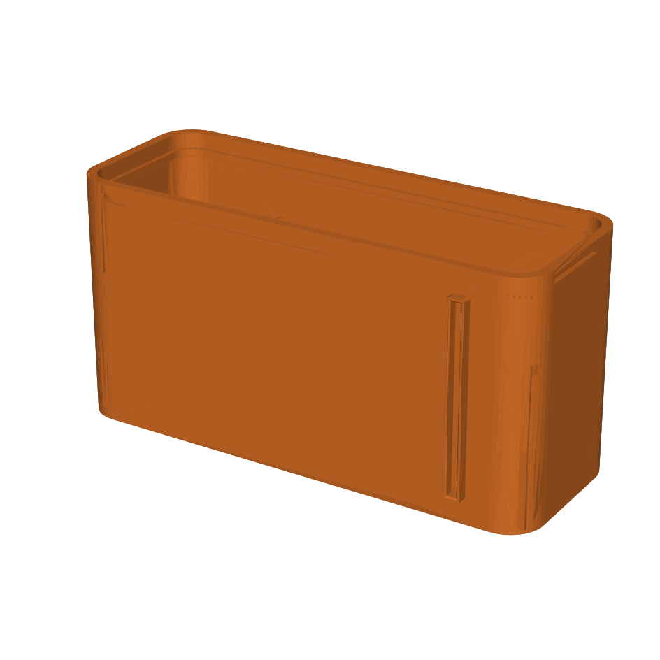
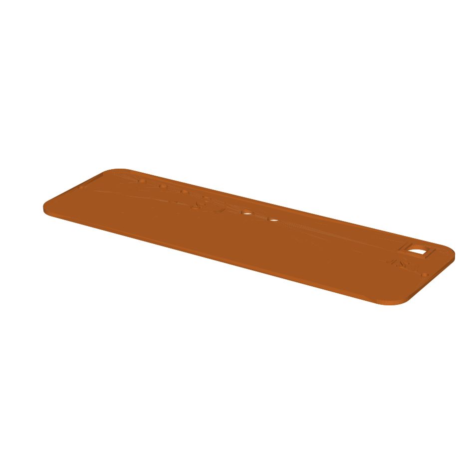
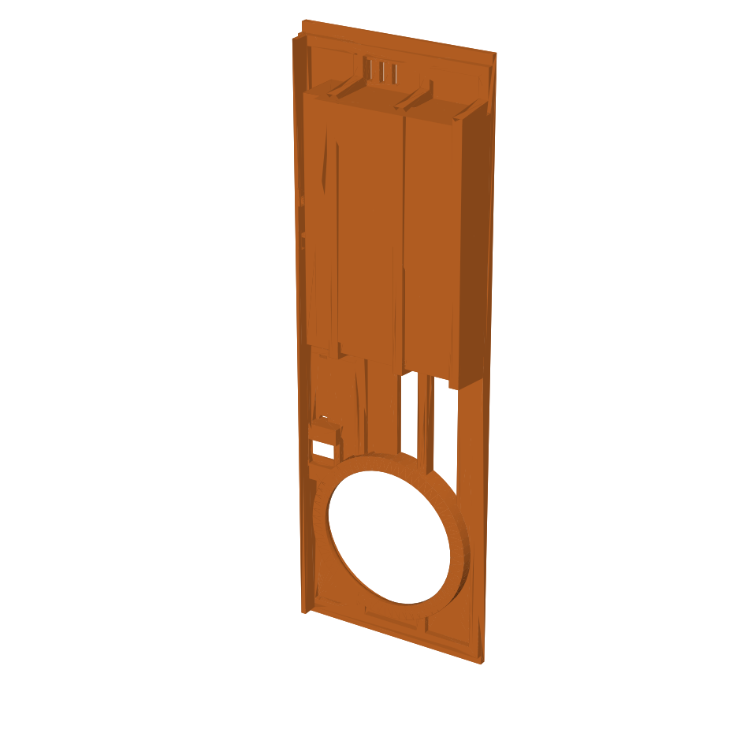
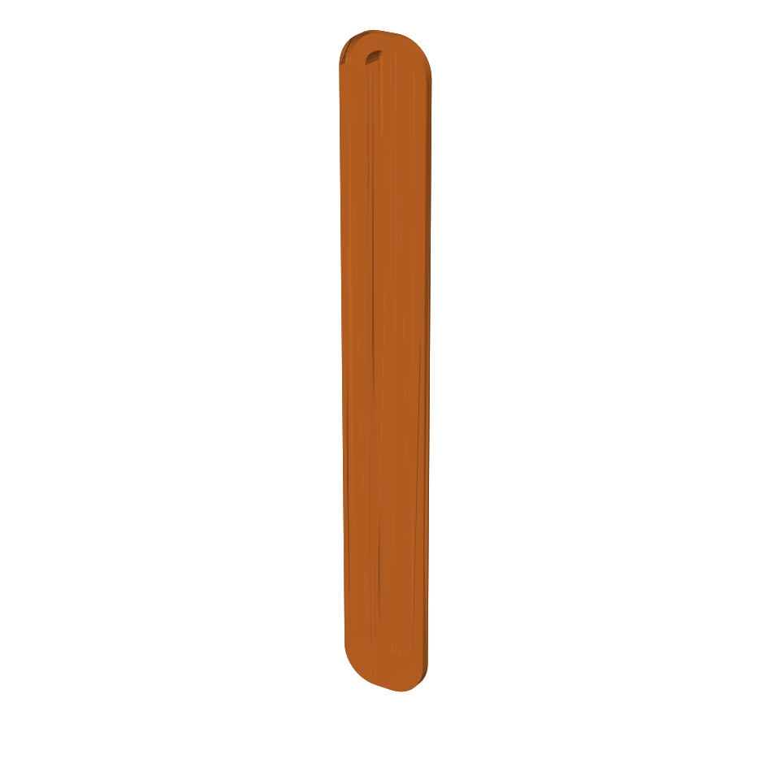
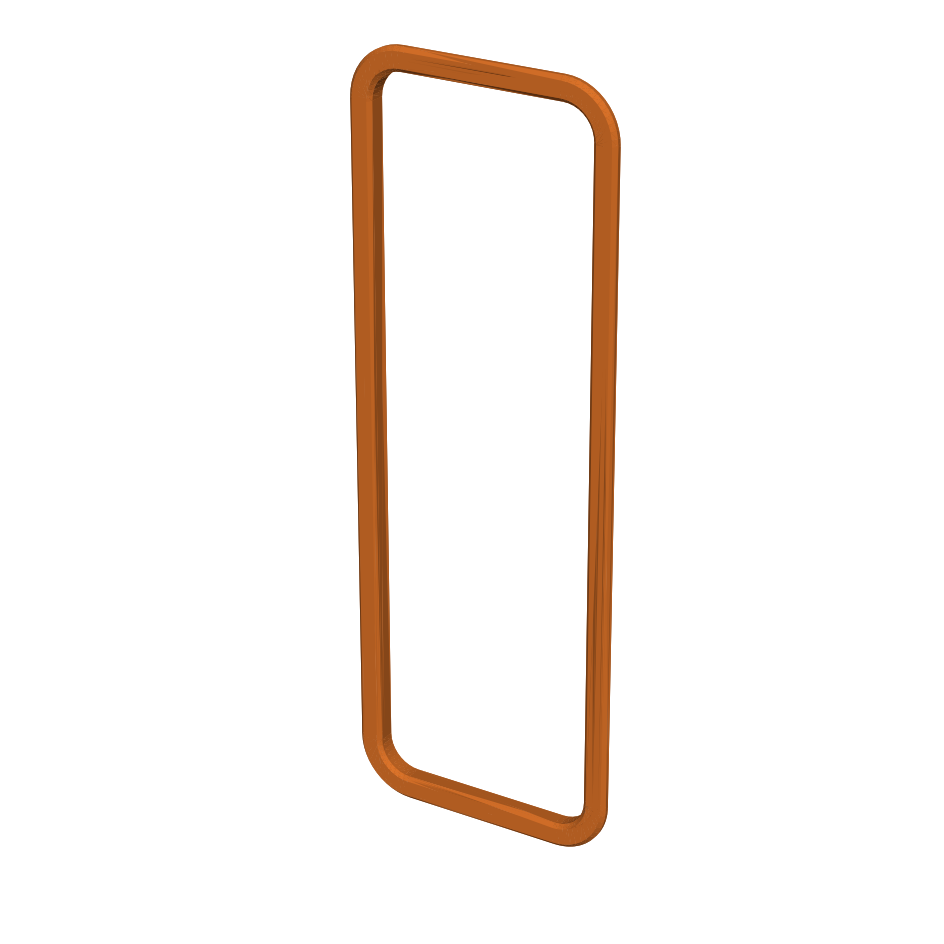
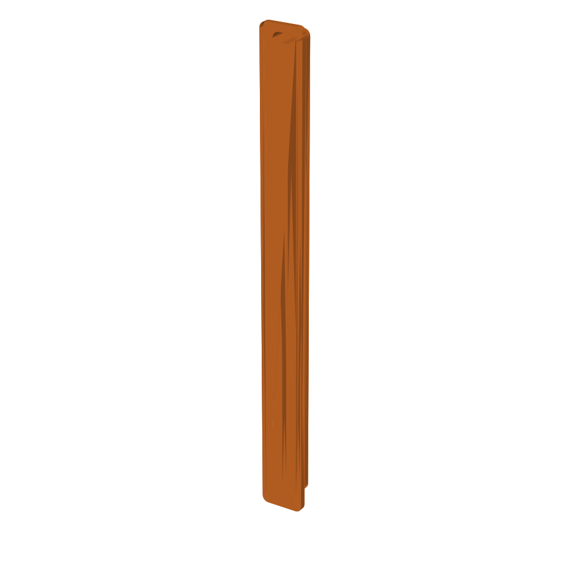

# 3D-printed enclosure

Printable parts for the clock case. All files are `.3mf`. Print the rigid parts
in **PETG** (chosen mainly because the 7805 regulator runs hot, and PETG handles
the heat better than PLA); print the feet in **TPU**.

| Preview | Part | File | Qty | Supports | Notes |
|---------|------|------|-----|----------|-------|
|  | Main body / shell | [`main-body.3mf`](main-body.3mf) | 1 | **Yes** | The enclosure everything mounts inside. Takes 2× M3 heat-set inserts (see *Hardware*). |
|  | Rear panel | [`rear-panel.3mf`](rear-panel.3mf) | 1 | No | MMU / multi-color: printed labels for each rear button, the temperature-probe jacks, and the barrel-jack voltage. Screws onto the main body. |
|  | Component panel | [`component-panel.3mf`](component-panel.3mf) | 1 | **Yes** | Internal bracket that holds the accessory hardware: alarm speaker, RTC coin-cell holder, and the snooze button. |
|  | Snooze button cap | [`snooze-button-cap.3mf`](snooze-button-cap.3mf) | 1 | No | One printed rocker cap; the two physical tact switches sit under its edges. Mounts in the component panel. |
|  | Front bezel | [`front-bezel.3mf`](front-bezel.3mf) | 1 | No | Hides the rough-cut front plexiglass edge. **Scale to 98 %** to fit as-is — or shave the lip if you print at 100 %. |
|  | Foot | [`foot-tpu.3mf`](foot-tpu.3mf) | 2 | No | Print in **TPU** (flexible). |

> Preview images in `renders/` are auto-generated from the `.3mf` files by
> [`_render.py`](_render.py) (a throwaway matplotlib/trimesh helper).

## Hardware (case assembly)

- **2× M3 heat-set threaded inserts** — installed in the main body.
- **2× M3×4 screws** — fasten the rear panel into those inserts.

(Electronics/wiring hardware is covered in the main project docs.)

## Print tips

- Everything rigid is **PETG** — the 7805 linear regulator dumps a fair bit of
  heat, so PLA isn't ideal near it.
- The main body and component panel use supports; orient so the support contact
  stays off visible faces.
- The rear panel is set up for a multi-material (MMU) printer so the labels come
  out in a contrasting color; on a single-material printer it still prints fine,
  the markings just won't be color-separated.
- Front bezel: if it's tight, the 98 % scale is the easy fix; the alternative is
  trimming the locating lip.
