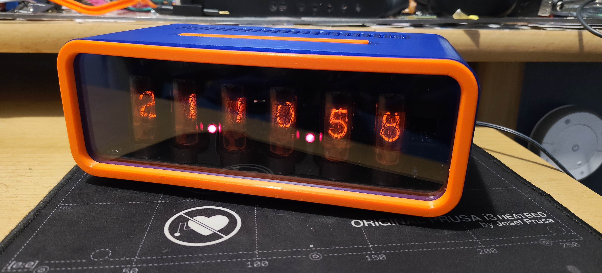

# NixieClock (ESP-IDF firmware)

ESP-IDF + PlatformIO firmware for a 6-tube multiplexed nixie clock, replacing
the original ESPHome config (`nixieclock.yaml`, kept for reference). WiFi is used
for time sync and remote control; the clock keeps running (and keeps time, via
its RTC) with no network.



> **New here?** See **[GUIDE.md](GUIDE.md)** — a bilingual (English / Čeština)
> user guide with a *For everyone* section (setup, buttons, web page) and a
> *Power users* section (REST, MQTT/Home Assistant, building the firmware).

## Hardware

ESP32 (WROOM-32) on the **UCB32** controller board driving the
[**Unidisp**](https://github.com/Unipuls80/Unidisp) display board:

- Onboard UC3845 HV supply (~180 V, **no dimming input** → brightness is done in
  firmware by PWM-ing each tube's anode within its multiplex slot — the headline
  feature that wasn't possible under ESPHome).
- **MH74141** BCD cathode driver (old/slow Tesla part), **74×42** 1-of-10 anode
  multiplexer, 6× Z57xM/ZM1080 tubes. No per-digit decimal points — the only
  separator is the colon between the MM:SS pair.
- **PCF8563** RTC @ I²C 0x51 (driver also auto-detects DS1307/DS3231 @ 0x68).
- 5 front buttons on the multiplexed KEY line + a dedicated snooze button.
- Passive piezo buzzer on the ALM line (LEDC tone / RTTTL).
- Up to 2× **DS18B20** 1-Wire temperature sensors on GPIO13 (needs a 4.7 kΩ
  pull-up to 3.3 V).

Full pin map: [`components/common/include/pins.h`](components/common/include/pins.h).

## Build & flash

Requires [PlatformIO](https://platformio.org/install) (CLI or the VS Code ext).

```sh
pio run                 # build
pio run -t upload       # build + flash over USB
pio device monitor      # serial console @ 115200
```

PlatformIO downloads the ESP-IDF 5.5 toolchain and the managed components
(`espressif/onewire_bus`, `espressif/ds18b20`) automatically on first build.
After changing a component's `idf_component.yml` or `REQUIRES`, do a clean
configure (`rm -rf .pio/build/esp32dev`) so the component manager re-runs.

> The board has **no auto-reset**: hold IO0, tap EN, release IO0 to enter
> download mode before `pio run -t upload`.

## First-time setup / credentials

Credentials live in NVS (set via the SoftAP portal or the web UI).
`components/common/include/secrets.h` (gitignored) is a **first-boot fallback
only**: once a WiFi SSID is stored in NVS the device trusts NVS exclusively (an
empty MQTT host means *no MQTT* — the client goes idle), and a factory reset
forces SoftAP setup on the next boot regardless of `secrets.h`.

To seed defaults at compile time, copy the template:

```sh
cp components/common/include/secrets.example.h components/common/include/secrets.h
# edit WIFI_SSID / WIFI_PASS / MQTT_* 
```

Or skip `secrets.h` entirely and provision over WiFi (see below).

## WiFi provisioning (SoftAP)

To set credentials without editing code (e.g. when lending the clock):

1. **Enter provisioning** — hold the provision button (button 5) during the
   boot window, or long-hold it (~3 s) during normal operation; it reboots into
   setup mode. (A board with no stored creds and no fallback SSID enters it
   automatically.)
2. The tubes show an **8-digit PIN** in two halves (colon lit = first half).
   Join the open-looking `NixieClock-XXXXXX` WiFi using that PIN as the WPA2
   password — so only someone looking at the clock can connect.
3. A captive portal opens: pick your network, enter the password (and optionally
   MQTT settings), save. The clock stores the creds and reboots onto your LAN.

WiFi/MQTT can also be changed live from the web UI's **Network** section (MQTT
applies immediately; WiFi on next reboot).

## Buttons

| Button | Short press | Long hold |
|--------|-------------|-----------|
| 1 | Brightness up | — |
| 2 | Brightness down | — |
| 3 | Show temperature now | — |
| 4 | Anti-poison scrub now | — |
| 5 (provision) | Show IP address on tubes | ~3 s: provisioning · ~10 s: factory reset |
| Snooze | Snooze ringing alarm | Dismiss alarm (until tomorrow) |

Bonus combo: **hold brightness + and − together (~2 s)** toggles the alarm on/off.

## Control surfaces

All three share one settings store, so changes from any surface are reflected
everywhere instantly:

- **Web UI** — `http://<clock-ip>/` : brightness, night schedule, anti-poison,
  alarm (incl. day-of-week + melody + snooze), temperature slots/decimals, and
  network config. Tap button 5 to see the IP on the tubes.
- **MQTT + Home Assistant** — auto-discovers as a *Nixie Clock* device
  (`nixie-<mac>`). Topics under `nixieclock/<node>/…`, HA discovery under
  `homeassistant/…`.
- **REST/JSON** — `GET /api/state`, `POST /api/set?k=<key>` (value in body),
  `POST /api/action?a=<action>`, `GET /api/net`, `POST /api/netset`.

## Features

- Smooth multiplex PWM brightness, ghost-free (cathode-before-anode + dead-time).
- SNTP timekeeping (Europe/Prague), seeded from and written back to the RTC.
- Manual brightness + night dimming (default 20:30→06:00); hook for a future
  BH1750 light sensor.
- Anti-cathode-poisoning cycle (periodic + on-demand).
- Two temperature slots shown near the end of each minute (sec 52–55), each fed
  by MQTT or a DS18B20; configurable decimals; negatives shown by blinking
  (no minus glyph), colon used as the decimal point.
- Alarm with snooze + dismiss, day-of-week mask, and RTTTL melodies.
- Cold-start "slot machine" animation until the time is known.

## Project layout

```
platformio.ini             build config (env: esp32dev), custom partition table
partitions.csv             single ~2.8 MB app + NVS + SPIFFS (4 MB flash)
sdkconfig.defaults         ESP-IDF defaults
src/main.c                 app entry: orchestration + display draw loop
components/
  common/                  shared pin map + secrets (header-only)
  nixie/                   GPTimer multiplex display driver + PWM brightness
  i2cbus/                  shared I²C master + bus scanner
  rtcdev/                  RTC driver (PCF8563 / DS1307 / DS3231 auto-detect)
  netclock/                WiFi STA + SNTP
  netcfg/                  WiFi/MQTT credential store (NVS + secrets fallback)
  provision/               SoftAP captive-portal WiFi provisioning
  settings/                persisted settings blob (NVS) + change versioning
  control/                 shared key=value apply + state-JSON core
  mqttctrl/                MQTT client + Home Assistant autodiscovery
  webui/                   self-hosted web UI + REST/JSON API
  temps/                   temperature slots + DS18B20 (RMT 1-Wire)
  buttons/                 multiplexed-button debounce + classification
  alarm/                   alarm state machine
  buzzer/                  LEDC tone + RTTTL player
  antipoison/              anti-cathode-poisoning routine
```

Architecture note: `control` is the single place that maps a setting key=value
and renders the state JSON; MQTT, the web UI, and REST all go through it, so
adding a setting touches one switch and one JSON builder, not three.

## License

This project uses reciprocal ("share-alike") open licenses — you may use, copy,
and modify it, including commercially, but you must publish your modifications to
whichever part you change:

- **Firmware / source code** — [GNU GPL v3](LICENSE) (`LICENSE` at the repo root).
- **UCB32 controller board** (`PCB_Sources/ucb vibecheck_final/`) —
  [CERN-OHL-S v2](PCB_Sources/ucb%20vibecheck_final/LICENSE.txt) (CERN Open
  Hardware Licence, Strongly Reciprocal).

Third-party content keeps its own license: the **Unidisp** display board
(`PCB_Sources/Unidisp-main/`) is licensed by its author under CERN-OHL-W (Weakly
Reciprocal) — see its bundled `LICENSE`. The original ESPHome reference
(`nixieclock.yaml`) is retained only for reference.

## Credits

This started as a university project. The **Unidisp** digitron display board —
the HV supply, multiplexing, and tube driving — is the work of
[**@Unipuls80**](https://github.com/Unipuls80), along with his original
[Unidisp](https://github.com/Unipuls80/Unidisp) and an
[MH106 ASIC-based controller (ucb106)](https://github.com/Unipuls80/ucb106).

The **UCB32** controller board and this ESP32 firmware are my "modern" take on
driving the same display — by **Michal Basler** ([@Majklzbastlirny](https://github.com/Majklzbastlirny)).
